# SGI-FORM — Documentacion Tecnica Integral

> **SGI-FORM** — Gestion inteligente de inspecciones en terreno.
> Nombre tecnico interno: SgiForm | Version 1.0.0 | .NET 8 | PostgreSQL 17 | Blazor Server | .NET MAUI Android

---

## Tabla de contenidos

1. [Que es SgiForm](#1-que-es-sgiform)
2. [Problema que resuelve](#2-problema-que-resuelve)
3. [Stack tecnologico](#3-stack-tecnologico)
4. [Arquitectura general](#4-arquitectura-general)
5. [Estructura del repositorio](#5-estructura-del-repositorio)
6. [Capas de la solucion](#6-capas-de-la-solucion)
7. [Base de datos](#7-base-de-datos)
8. [Backend API](#8-backend-api)
9. [Frontend Web (Blazor)](#9-frontend-web-blazor)
10. [App movil (MAUI Android)](#10-app-movil-maui-android)
11. [Motor de formularios dinamicos](#11-motor-de-formularios-dinamicos)
12. [Sincronizacion offline-first](#12-sincronizacion-offline-first)
13. [Roles y permisos](#13-roles-y-permisos)
14. [Flujos principales](#14-flujos-principales)
15. [Testing](#15-testing)
16. [Guia de onboarding](#16-guia-de-onboarding)
17. [Archivos clave](#17-archivos-clave)
18. [Deuda tecnica y puntos de atencion](#18-deuda-tecnica-y-puntos-de-atencion)
19. [Glosario](#19-glosario)

---

## 1. Que es SGI-FORM

SGI-FORM (Sistema de Gestion de Inspecciones — Formularios) es una plataforma SaaS B2B que permite a empresas sanitarias ejecutar campanas masivas de inspeccion tecnica en terreno. El sistema gestiona el ciclo completo: desde la carga de servicios a inspeccionar, la configuracion de formularios dinamicos, la asignacion a operadores de campo, la ejecucion offline en dispositivos Android, hasta la revision de resultados y exportacion de reportes.

> **Nota sobre nombres**: El branding comercial es **SGI-FORM**. Los namespaces C#, carpetas y solucion usan el nombre tecnico **SgiForm** por razones historicas. No se planea renombrar los namespaces.

---

## 2. Problema que resuelve

Las empresas sanitarias necesitan inspeccionar periodicamente miles de medidores de agua, conexiones domiciliarias y servicios. Antes de este sistema:

- Las inspecciones se realizaban con formularios en papel o planillas Excel sueltas
- Las fotografias se perdian o no se asociaban al servicio correcto
- No habia trazabilidad GPS de donde se ejecuto la inspeccion
- El reproceso de datos era manual y propenso a errores
- No habia control de calidad en tiempo real
- Los reportes para la superintendencia requerian compilacion manual

SgiForm reemplaza todo eso con una plataforma digital integrada.

---

## 3. Stack tecnologico

| Componente | Tecnologia | Version | Rol en el proyecto |
|---|---|---|---|
| SDK | .NET | 8.0.319 | Plataforma base de toda la solucion |
| API | ASP.NET Core Web API | 8.0 | Backend REST que expone todos los endpoints |
| ORM | Entity Framework Core | 8.0 | Mapeo objeto-relacional contra PostgreSQL |
| Base de datos | PostgreSQL | 17 | Almacenamiento persistente principal |
| Web admin | Blazor Server | 8.0 | Interfaz administrativa con render interactivo |
| App movil | .NET MAUI Android | 8.0 | Aplicacion de campo con capacidad offline |
| BD movil | SQLite (sqlite-net-pcl) | 1.9.172 | Almacenamiento local en el dispositivo |
| MVVM movil | CommunityToolkit.Mvvm | 8.3.2 | Patron MVVM con source generators |
| Auth | JWT Bearer + BCrypt | — | Autenticacion stateless con tokens |
| Excel | ClosedXML | 0.102.1 | Importacion y exportacion de archivos Excel |
| Logging | Serilog | 8.0 | Logging estructurado a consola y archivo |
| API docs | Swagger/OpenAPI | 6.5 | Documentacion interactiva de endpoints |
| Tests | xUnit + FluentAssertions | 2.5/6.12 | Tests de integracion con WebApplicationFactory |
| Contenedor | Docker | — | PostgreSQL corre en container Docker |

### Porque estas tecnologias

- **.NET 8**: LTS, rendimiento alto, ecosistema unificado para API + Web + Mobile.
- **Blazor Server**: renderiza en el servidor via SignalR, no requiere compilar a WebAssembly, ideal para admin interna.
- **MAUI Android**: comparte codigo C# con el backend, SQLite nativo para offline.
- **PostgreSQL**: soporte nativo para UUID, JSONB, enums, full-text search.
- **JWT**: stateless, ideal para app movil que trabaja offline y se conecta intermitentemente.

---

## 4. Arquitectura general

### Diagrama de despliegue

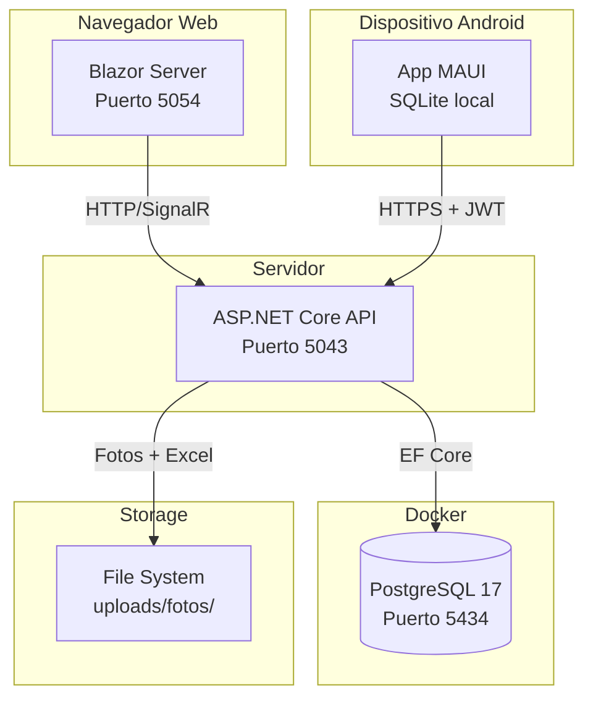

### Flujo de datos general

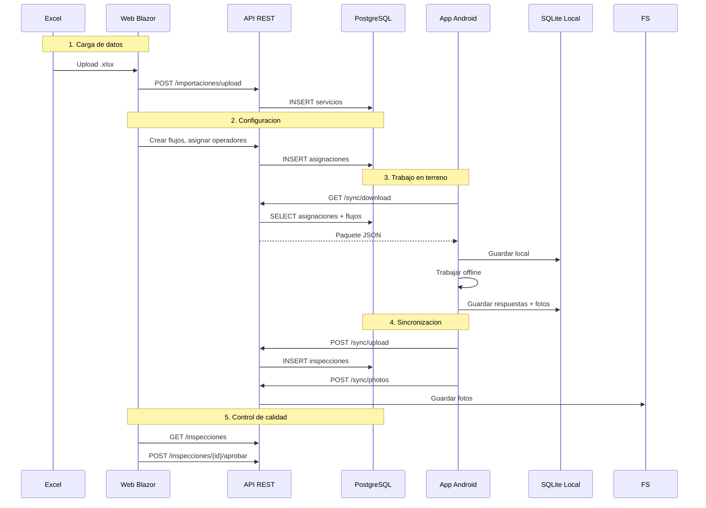

---

## 5. Estructura del repositorio

```
SgiForm/
|-- database/                          # Scripts SQL
|   |-- 01_schema.sql                  # Schema completo (tablas, indices, triggers, vistas)
|   |-- 02_seed.sql                    # Datos iniciales (empresa demo, flujo ejemplo)
|   |-- demo_servicios.xlsx            # Excel de ejemplo con 50 servicios
|
|-- src/
|   |-- SgiForm.Domain/          # Capa de dominio (entidades, enums)
|   |-- SgiForm.Application/     # Capa de aplicacion (DTOs, interfaces)
|   |-- SgiForm.Infrastructure/  # Capa de infraestructura (EF Core, servicios)
|   |-- SgiForm.Api/             # API REST (controllers, Program.cs)
|   |-- SgiForm.Web/             # Admin web Blazor Server
|   |-- SgiForm.Mobile/          # App Android MAUI offline-first
|
|-- shared/
|   |-- SgiForm.Contracts/       # DTOs compartidos entre API y consumidores
|
|-- tests/
|   |-- SgiForm.Tests/           # Tests de integracion (40 tests)
|
|-- tools/
|   |-- ExcelGen/                     # Utilidad para generar Excel de prueba
|
|-- global.json                        # Fija SDK a .NET 8.0.319
|-- SgiForm.sln                   # Solucion Visual Studio
|-- README.md                          # Documentacion rapida
```

---

## 6. Capas de la solucion

### Diagrama de dependencias

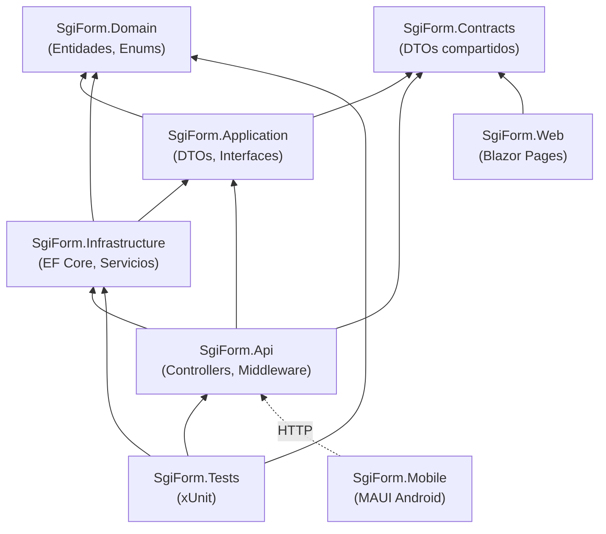

### 6.1 Domain (`SgiForm.Domain`)

Capa sin dependencias externas. Contiene:

- **`Entities/BaseEntity.cs`**: Clase base con `Id` (UUID), `CreatedAt`, `UpdatedAt`. La clase `SoftDeleteEntity` agrega `DeletedAt` para borrado logico.
- **`Entities/Empresa.cs`**: Tenant raiz del sistema multitenant.
- **`Entities/Usuario.cs`**: Incluye `Usuario`, `Rol`, `Permiso`, `RolPermiso`, `RefreshToken`.
- **`Entities/Operador.cs`**: Operador de campo con login movil independiente.
- **`Entities/Flujo.cs`**: Toda la estructura del motor de formularios: `Flujo`, `FlujoVersion`, `FlujoSeccion`, `FlujoPregunta`, `FlujoOpcion`, `FlujoRegla`.
- **`Entities/Inspeccion.cs`**: Entidades de operacion: `ImportacionLote`, `ServicioInspeccion`, `AsignacionInspeccion`, `Inspeccion`, `InspeccionRespuesta`, `InspeccionFotografia`, `InspeccionHistorial`, `SincronizacionLog`, `Catalogo`, `Auditoria`.
- **`Enums/DomainEnums.cs`**: 10 enums que definen estados, tipos de control, operadores logicos, acciones de reglas, prioridades.

### 6.2 Application (`SgiForm.Application`)

Capa preparada para casos de uso y DTOs. En la version actual esta mayoritariamente vacia (contiene `Class1.cs` placeholder). La logica de negocio esta directamente en los controllers de la API.

> **Nota**: Esta capa existe como placeholder arquitectonico. En la evolucion del proyecto, los controllers deberian delegar a servicios de Application.

### 6.3 Infrastructure (`SgiForm.Infrastructure`)

Implementaciones concretas:

- **`Persistence/AppDbContext.cs`**: DbContext de EF Core con mapeo explicito de todas las entidades a tablas PostgreSQL (nombres snake_case, columnas mapeadas individualmente).
- **`Persistence/SnakeCaseEnumConverter.cs`**: ValueConverter que transforma enums C# PascalCase a snake_case para compatibilidad con las columnas VARCHAR de PostgreSQL (ej: `EnEjecucion` -> `"en_ejecucion"`).
- **`Services/AuthService.cs`**: Autenticacion JWT para usuarios web y operadores moviles. Genera access tokens (60 min) y refresh tokens (30 dias). Implementa bloqueo por intentos fallidos.
- **`Services/ExcelImportService.cs`**: Procesamiento de archivos Excel con ClosedXML. Valida columnas, tipos de datos, detecta duplicados, y registra errores por fila.

### 6.4 Contracts (`SgiForm.Contracts`)

Libreria compartida para DTOs entre la API y sus consumidores. En la version actual esta vacia (placeholder). Los DTOs se definen como records directamente en cada controller.

### 6.5 API (`SgiForm.Api`)

12 controllers REST documentados con Swagger:

| Controller | Ruta base | Funcionalidad |
|---|---|---|
| `AuthController` | `/api/v1/auth` | Login web, login movil, refresh, logout |
| `OperadoresController` | `/api/v1/operadores` | CRUD operadores de campo |
| `UsuariosController` | `/api/v1/usuarios` | CRUD usuarios web + roles |
| `TiposInspeccionController` | `/api/v1/tipos-inspeccion` | CRUD tipos de inspeccion |
| `FlujoController` | `/api/v1/flujos` | Flujos, versiones, secciones, preguntas, reglas, publicacion |
| `ImportacionController` | `/api/v1/importaciones` | Upload Excel, preview, confirmar, errores |
| `ServiciosController` | `/api/v1/servicios` | Listado con filtros y paginacion |
| `AsignacionController` | `/api/v1/asignaciones` | Asignacion individual, masiva, cambio de estado |
| `InspeccionesController` | `/api/v1/inspecciones` | Listado, aprobar, observar, rechazar |
| `SyncController` | `/api/v1/sync` | Download, upload, photos (protocolo offline) |
| `DashboardController` | `/api/v1/dashboard` | KPIs, avance por operador/localidad/ruta |
| `ReportesController` | `/api/v1/reportes` | Exportacion Excel, reportes por operador/localidad |

### 6.6 Web (`SgiForm.Web`)

Blazor Server con render interactivo. 13 paginas + 2 componentes compartidos:

| Pagina | Ruta | Descripcion |
|---|---|---|
| `Login.razor` | `/login` | Formulario de login con JWT |
| `Home.razor` | `/` | Dashboard con KPIs en tarjetas |
| `Operadores.razor` | `/operadores` | CRUD con tabla, filtros, modal, paginacion |
| `Usuarios.razor` | `/usuarios` | CRUD usuarios con selector de rol |
| `TiposInspeccion.razor` | `/tipos-inspeccion` | CRUD tipos con iconos y colores |
| `Flujos.razor` | `/flujos` | Constructor visual de flujos (2 paneles) |
| `Importaciones.razor` | `/importaciones` | Wizard de 4 pasos para carga Excel |
| `Servicios.razor` | `/servicios` | Listado con busqueda full-text y filtros |
| `Asignaciones.razor` | `/asignaciones` | Tabla + modal de asignacion masiva |
| `Inspecciones.razor` | `/inspecciones` | Listado con acciones de aprobacion |
| `ControlCalidad.razor` | `/control-calidad` | Vista dedicada para revision con cards |
| `Reportes.razor` | `/reportes` | Exportacion Excel + tablas de productividad |
| `Error.razor` | `/Error` | Pagina de error generica |

**Servicios Blazor:**

- `AuthStateService.cs`: Maneja el estado de sesion JWT en memoria (scoped por circuito SignalR). Reemplaza `IHttpContextAccessor` que no funciona con Blazor interactivo.
- `ApiClient.cs`: HttpClient tipado que inyecta automaticamente el JWT en cada request a la API.

### 6.7 Mobile (`SgiForm.Mobile`)

App .NET MAUI Android con arquitectura MVVM:

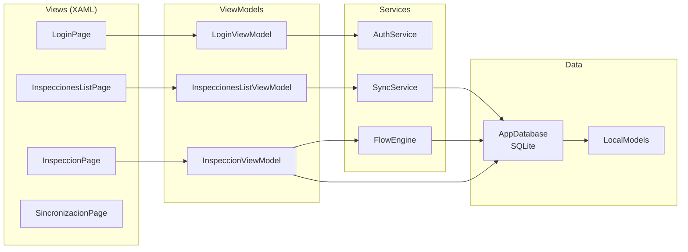

**Modelos locales** (`LocalModels.cs`): Versiones aplanadas de las entidades del servidor optimizadas para SQLite. Incluyen `AsignacionLocal`, `InspeccionLocal`, `RespuestaLocal`, `FotografiaLocal`, `SyncQueueItem` (cola de sincronizacion persistente), y tablas de flujos (`FlujoVersionLocal`, `SeccionLocal`, `PreguntaLocal`, `OpcionLocal`, `ReglaLocal`).

---

## 7. Base de datos

### Diagrama entidad-relacion (simplificado)

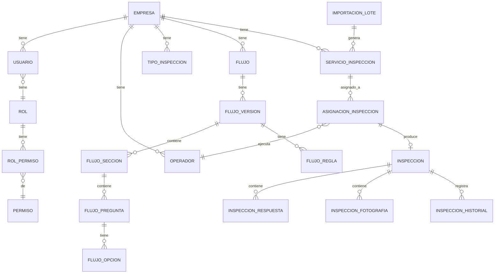

### Schema PostgreSQL

El schema completo esta en `database/01_schema.sql` (999 lineas). Usa el schema `sf` para aislar las tablas del sistema.

**Extensiones requeridas:**
- `uuid-ossp` — generacion de UUIDs
- `pg_trgm` — busqueda por similitud de texto
- `unaccent` — busqueda sin tildes

**Tablas principales (21):**

| Grupo | Tablas |
|---|---|
| IAM | `empresa`, `usuario`, `rol`, `permiso`, `rol_permiso`, `refresh_token`, `operador` |
| Flujos | `tipo_inspeccion`, `flujo`, `flujo_version`, `flujo_seccion`, `flujo_pregunta`, `flujo_opcion`, `flujo_regla` |
| Importacion | `importacion_lote`, `importacion_detalle`, `servicio_inspeccion` |
| Inspecciones | `asignacion_inspeccion`, `inspeccion`, `inspeccion_respuesta`, `inspeccion_fotografia`, `inspeccion_historial` |
| Operacion | `sincronizacion_log`, `catalogo`, `auditoria` |

**Caracteristicas del schema:**
- Todas las PKs son UUID v4
- `created_at` y `updated_at` automaticos (triggers)
- Soft delete (`deleted_at`) en entidades principales
- Indices en todas las FKs y campos de busqueda frecuente
- Indices trigram (`gin_trgm_ops`) para busqueda de texto en `direccion` y `nombre_cliente`
- Aislamiento multitenant via `empresa_id` en cada tabla

> **Nota sobre enums**: El schema original define enums nativos de PostgreSQL (`CREATE TYPE sf.estado_usuario AS ENUM ...`). Durante el desarrollo se convirtieron a `VARCHAR` para compatibilidad con EF Core. Los enums C# se convierten a snake_case via `SnakeCaseEnumConverter`.

### Docker

El sistema usa un container Docker dedicado:

```
Nombre:   sgiform_postgres
Imagen:   postgres:17
Puerto:   localhost:5434 -> 5432
BD:       sgiform
Usuario:  sgiform
Password: SgiForm2024!
```

---

## 8. Backend API

### Configuracion (`Program.cs`)

El archivo `Program.cs` configura:

1. **Logging**: Serilog (deshabilitado en entorno "Testing" para compatibilidad con WebApplicationFactory)
2. **EF Core**: Npgsql con connection string desde `appsettings.json`
3. **JWT**: HS256 con clave simetrica, expiracion 60 minutos, validacion de issuer/audience
4. **CORS**: Origenes configurables desde `appsettings.json`
5. **Servicios**: `AuthService` y `ExcelImportService` registrados como Scoped
6. **JSON**: Naming policy snake_case, ignora nulls
7. **Swagger**: Con soporte de autorizacion Bearer
8. **Health checks**: PostgreSQL health check (condicional, no se ejecuta en testing)
9. **Error handler**: Middleware global que retorna JSON con detalle en desarrollo

### Autenticacion

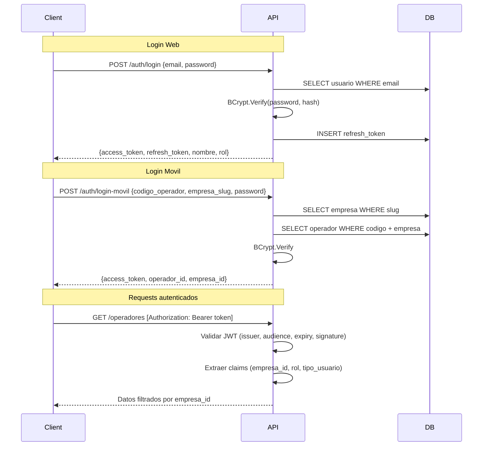

**Claims del JWT:**
- `NameIdentifier`: ID del usuario u operador
- `Email`: correo del usuario
- `Name`: nombre completo
- `Role`: codigo del rol (`admin`, `supervisor`, `operador`, etc.)
- `empresa_id`: UUID de la empresa (para filtrado multitenant)
- `tenant_slug`: slug de la empresa
- `tipo_usuario`: `"web"` o `"movil"`

### Importacion Excel

El endpoint `POST /importaciones/upload` acepta archivos .xlsx con estas columnas esperadas:

```
id_servicio | numero_medidor | Marca | diametro | direccion |
nombre | coordenadax | coordenaday | lote | localidad |
ruta | libreta | observacion_libre
```

El flujo es: **Upload -> Preview -> Confirmar -> Resultado**.

El servicio `ExcelImportService` implementa:
- Mapeo flexible de nombres de columnas (acepta variantes como `coordenada_x`, `x`, `coordenadax`)
- Validacion de columnas obligatorias (`id_servicio` minimo)
- Validacion de tipos (coordenadas deben ser numericas)
- Deteccion de duplicados por `id_servicio + empresa_id`
- Hash SHA256 del archivo para deduplicacion
- Registro de errores por fila con datos originales

---

## 9. Frontend Web (Blazor)

### Arquitectura

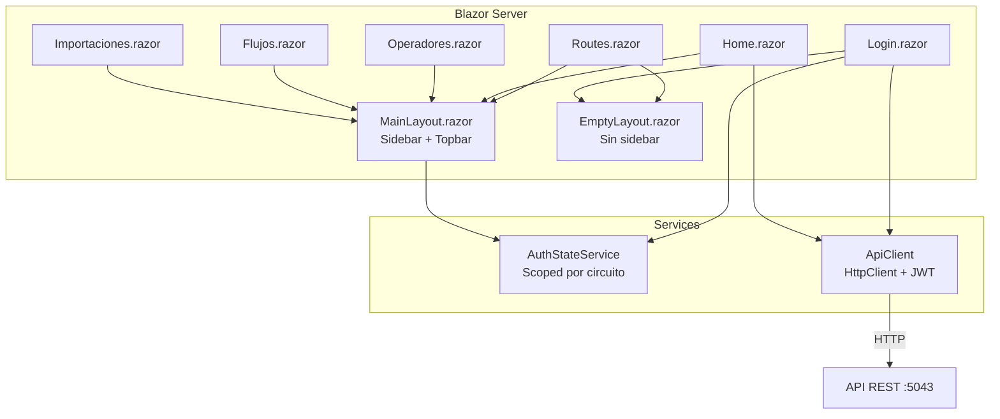

**Patron de autenticacion en Blazor:**

Blazor Server usa circuitos SignalR. El `IHttpContextAccessor` no esta disponible en componentes interactivos. Por eso se creo `AuthStateService`:

1. El usuario hace login en `Login.razor`
2. `ApiClient.LoginAsync()` llama a la API y recibe el JWT
3. El JWT se guarda en `AuthStateService` (scoped = vive mientras dure la conexion del navegador)
4. `MainLayout.razor` lee `AuthStateService.EsAutenticado` para decidir si mostrar el sidebar o redirigir a login
5. `ApiClient` inyecta el token en cada request via `Authorization: Bearer`

**CSS:** El sistema usa CSS custom sin frameworks (archivo `wwwroot/css/app.css`, 500+ lineas). Prefijo `sf-` para todas las clases. Grid layout con sidebar fijo + contenido scrollable.

---

## 10. App movil (MAUI Android)

### Arquitectura offline-first

La app esta disenada para funcionar 100% sin conexion:

1. **Login**: Requiere conexion una vez para obtener el JWT
2. **Descarga**: Baja asignaciones + flujos + catalogos al SQLite local
3. **Trabajo offline**: Todo se lee/escribe en SQLite
4. **Sincronizacion**: Cuando hay conexion, sube inspecciones y fotos

### Componentes principales

| Componente | Archivo | Responsabilidad |
|---|---|---|
| `AppDatabase` | `Database/AppDatabase.cs` | Wrapper sobre SQLite con metodos CRUD para cada tabla local. Configura pragmas WAL para rendimiento. |
| `AuthService` | `Services/AuthService.cs` | Login movil. Guarda JWT en `SecureStorage` y datos de sesion en `Preferences`. |
| `SyncService` | `Services/SyncService.cs` | Protocolo de sincronizacion completo (download/upload/photos). Cola persistente `SyncQueueItem`. |
| `FlowEngine` | `Services/FlowEngine.cs` | Motor de evaluacion de formularios dinamicos (ver seccion 11). |
| `LocalModels` | `Models/LocalModels.cs` | 12 clases SQLite con atributos `[Table]`, `[PrimaryKey]`. |

### Navegacion

```
Shell
|-- login (LoginPage)
|-- TabBar
    |-- inspecciones (InspeccionesListPage)
    |-- sincronizacion (SincronizacionPage)
|-- inspeccion (InspeccionPage) -- ruta registrada programaticamente
```

### Permisos Android

Definidos en `AndroidManifest.xml`:
- `ACCESS_NETWORK_STATE`, `INTERNET` — conectividad
- `ACCESS_FINE_LOCATION`, `ACCESS_COARSE_LOCATION` — GPS
- `CAMERA` — captura de fotos
- `READ/WRITE_EXTERNAL_STORAGE` — almacenamiento de fotos

---

## 11. Motor de formularios dinamicos

El motor es la pieza central del sistema. Permite definir formularios sin codigo.

### Estructura de un flujo

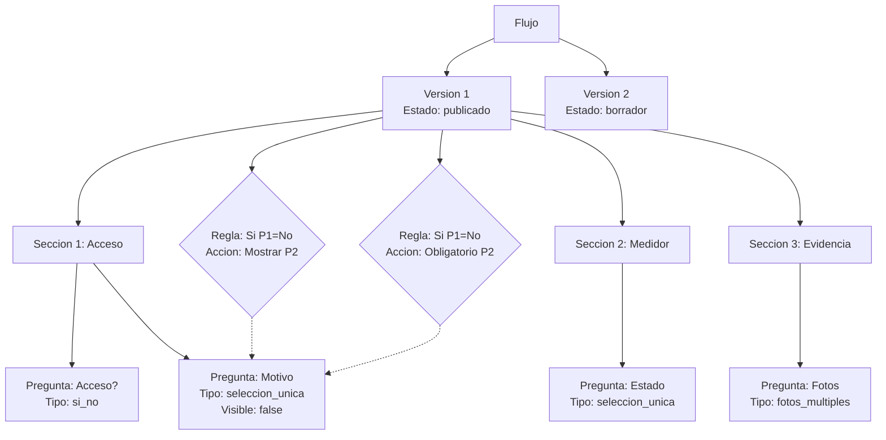

### Tipos de control soportados (20)

`texto_corto`, `texto_largo`, `entero`, `decimal`, `fecha`, `hora`, `fecha_hora`, `si_no`, `seleccion_unica`, `seleccion_multiple`, `lista`, `foto_unica`, `fotos_multiples`, `coordenadas`, `firma`, `calculado`, `etiqueta`, `checkbox`, `qr_codigo`, `archivo`

### Operadores de regla (14)

`eq` (igual), `neq` (distinto), `gt` (mayor), `lt` (menor), `gte` (mayor o igual), `lte` (menor o igual), `contains`, `not_contains`, `in`, `not_in`, `is_empty`, `is_not_empty`, `starts_with`, `ends_with`

### Acciones de regla (10)

`mostrar`, `ocultar`, `obligatorio`, `opcional`, `saltar_seccion`, `bloquear_cierre`, `calcular`, `asignar_valor`, `min_fotos`, `max_fotos`

### Ciclo de evaluacion (FlowEngine)

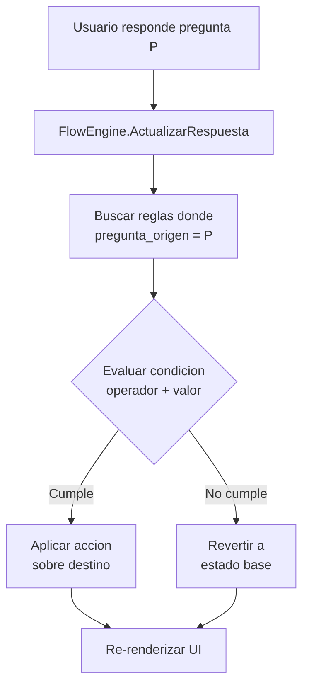

El motor opera tanto en el **servidor** (Blazor/API) como en el **cliente movil** (FlowEngine.cs en MAUI). Ambos usan la misma logica: cargar metadatos, evaluar reglas, aplicar acciones.

### Versionado

Los flujos se versionan. Una vez que una version se publica, es **inmutable**. Las inspecciones se vinculan a una version especifica, asi las inspecciones antiguas mantienen su estructura original aunque el flujo cambie.

---

## 12. Sincronizacion offline-first

### Protocolo

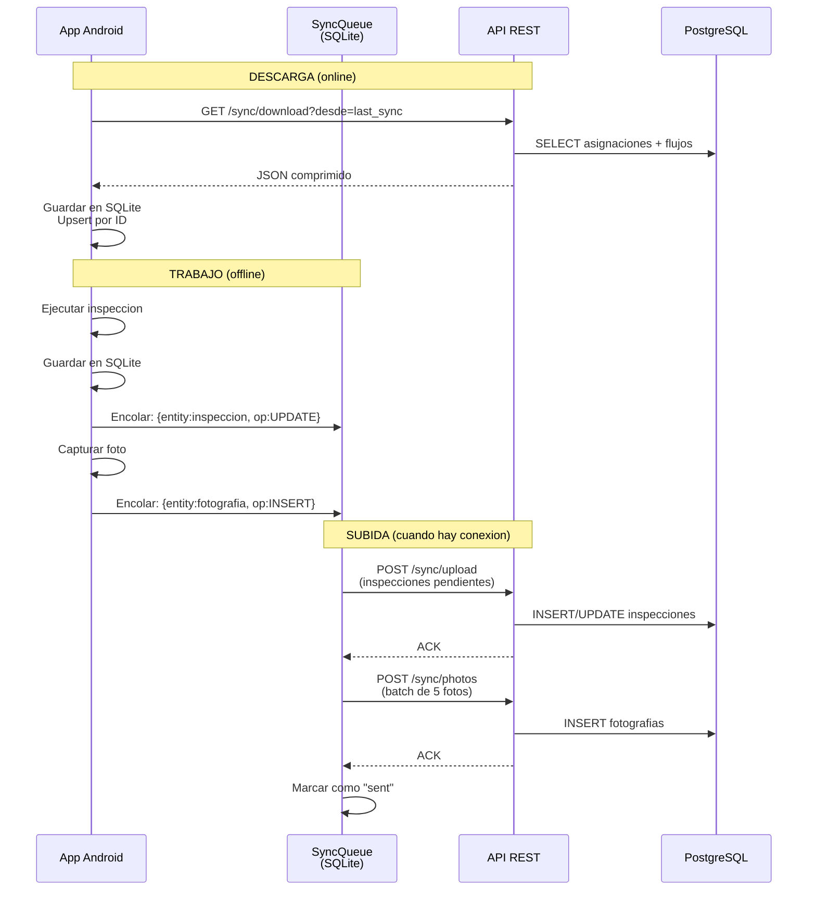

### Resolucion de conflictos

| Escenario | Estrategia |
|---|---|
| Misma inspeccion editada en movil y web | "Mobile wins" para datos de campo |
| Foto duplicada | Deduplicacion por hash SHA256 |
| Asignacion reasignada mientras se ejecuta | Mantener version local hasta cerrar |
| Flujo actualizado durante inspeccion | Usar la version descargada originalmente |

### Cola de sincronizacion

La tabla `sync_queue` en SQLite persiste las operaciones pendientes:

```
id | entity_type | entity_id | operation | estado | intentos | error
```

Estados: `pending` -> `sent` | `error` (con retry automatico).

---

## 13. Roles y permisos

### Roles del sistema

| Rol | Codigo | Acceso | Descripcion |
|---|---|---|---|
| **Administrador** | `admin` | Web | Acceso total. Crea usuarios, flujos, importa datos. |
| **Supervisor** | `supervisor` | Web | Gestiona asignaciones, revisa inspecciones, aprueba/rechaza. |
| **Auditor** | `auditor` | Web | Solo lectura. Consulta reportes y exporta datos. |
| **Cliente Consulta** | `cliente_consulta` | Web | Acceso limitado a dashboard e inspecciones aprobadas. |
| **Operador** | `operador` | Movil | Ejecuta inspecciones en terreno. Login exclusivo en la app. |

### Permisos granulares

40 permisos organizados por modulo:

```
empresas:     read, create, update, delete
usuarios:     read, create, update, delete
operadores:   read, create, update, delete
tipos_insp:   read, create, update, delete
flujos:       read, create, update, delete, publish
importaciones: read, create, delete
servicios:    read, update
asignaciones: read, create, update, delete, massive
inspecciones: read, approve, observe, reject
dashboard:    read
reportes:     excel, pdf, photos
admin:        full
```

### Multitenant

Cada request autenticado contiene el claim `empresa_id`. Todos los controllers filtran por este claim:

```csharp
private Guid EmpresaId =>
    Guid.Parse(User.FindFirst("empresa_id")!.Value);

// En cada query:
var q = _db.Operadores.Where(o => o.EmpresaId == EmpresaId);
```

---

## 14. Flujos principales

### Flujo 1: Configuracion inicial

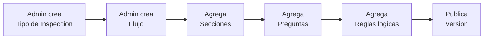

### Flujo 2: Carga de trabajo

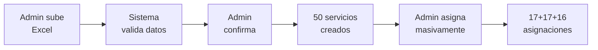

### Flujo 3: Ejecucion en terreno

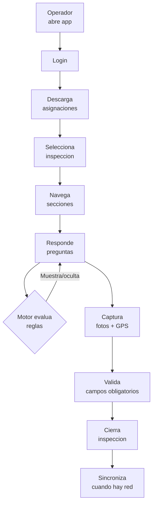

### Flujo 4: Control de calidad

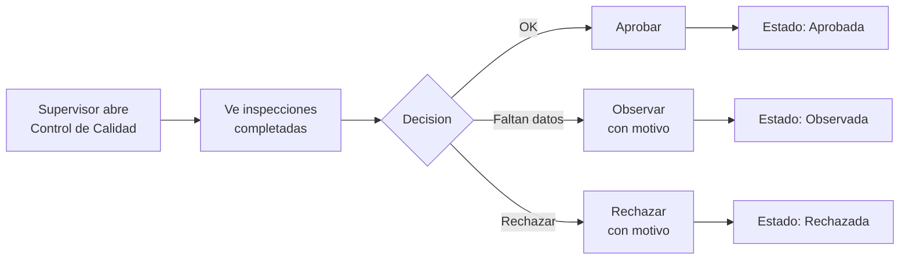

---

## 15. Testing

### Estructura

```
tests/SgiForm.Tests/
|-- TestFixture.cs           # WebApplicationFactory con BD InMemory + seed
|-- ApiIntegrationTests.cs   # 43 tests de integracion
```

### Fixture

`TestFixture` hereda de `WebApplicationFactory<Program>` y:

1. Reemplaza PostgreSQL por EF Core InMemory
2. Desactiva health checks de PostgreSQL
3. Usa entorno `"Testing"` para saltarse Serilog
4. Siembra datos de prueba (1 empresa, 2 roles, 1 admin, 2 operadores, 1 tipo inspeccion, 1 flujo con 2 preguntas y 1 regla, 10 servicios)
5. Provee `CreateAuthenticatedClientAsync()` que hace login y retorna un HttpClient con JWT

### Cobertura por modulo

| Clase de test | Tests | Que verifica |
|---|---|---|
| `AuthTests` | 9 | Login web/movil, credenciales invalidas, empresa invalida, endpoint sin token, refresh token valido/invalido/revocado |
| `OperadoresTests` | 5 | CRUD completo, duplicado, soft delete |
| `TiposInspeccionTests` | 3 | Listar, crear, duplicado |
| `FlujosTests` | 5 | Listar, version, crear, publicar ya publicado, editar publicado |
| `ServiciosTests` | 4 | Listar, filtro localidad, busqueda texto, paginacion |
| `AsignacionesTests` | 3 | Individual, masiva, cambio estado |
| `InspeccionesTests` | 1 | Listar vacio |
| `DashboardTests` | 3 | KPIs, por operador, por localidad |
| `UsuariosTests` | 4 | Listar, roles, crear, email duplicado |
| `ReportesTests` | 3 | Excel download, por operador, por localidad |
| `FlowEngineTests` | 3 | SnakeCaseEnumConverter: conversion, parse inverso, roundtrip |

**Total: 43 tests, 100% passing.**

### Ejecutar tests

```bash
cd kobotoolbox
dotnet test tests/SgiForm.Tests/SgiForm.Tests.csproj
```

---

## 16. Guia de onboarding

### Prerrequisitos

- .NET 8 SDK (8.0.319+)
- Docker Desktop
- Visual Studio 2022 o VS Code con extension C# Dev Kit
- (Opcional) Android SDK para compilar la app movil

### Paso 1: Clonar y verificar SDK

```bash
git clone <repositorio>
cd kobotoolbox
dotnet --version  # Debe mostrar 8.0.x (forzado por global.json)
```

### Paso 2: Levantar PostgreSQL

```bash
docker run -d --name sgiform_postgres \
  -e POSTGRES_USER=sgiform \
  -e POSTGRES_PASSWORD=SgiForm2024! \
  -e POSTGRES_DB=sgiform \
  -p 5434:5432 \
  --restart unless-stopped \
  postgres:17
```

### Paso 3: Ejecutar schema y seed

```bash
docker exec -i sgiform_postgres psql -U sgiform -d sgiform < database/01_schema.sql
docker exec -i sgiform_postgres psql -U sgiform -d sgiform < database/02_seed.sql
```

### Paso 4: Iniciar API

```bash
cd src/SgiForm.Api
dotnet run
# Swagger: http://localhost:5043
```

### Paso 5: Iniciar Web

```bash
cd src/SgiForm.Web
dotnet run --launch-profile http
# Web: http://localhost:5054
```

### Paso 6: Login

```
Email:    admin@sanitaria-demo.cl
Password: Admin@2024!
```

### Paso 7: Ejecutar tests

```bash
dotnet test tests/SgiForm.Tests/SgiForm.Tests.csproj
# Resultado esperado: 43/43 passed
```

### Paso 8: (Opcional) Compilar app Android

```bash
dotnet workload install maui-android
dotnet build src/SgiForm.Mobile/SgiForm.Mobile.csproj
```

---

## 17. Archivos clave

### Para entender el dominio

| Archivo | Por que importa |
|---|---|
| `Domain/Enums/DomainEnums.cs` | Define TODOS los estados y tipos del sistema |
| `Domain/Entities/Flujo.cs` | Estructura del motor de formularios (7 clases) |
| `Domain/Entities/Inspeccion.cs` | Entidades de operacion (12 clases) |
| `database/01_schema.sql` | Verdad absoluta del modelo de datos |
| `database/02_seed.sql` | Ejemplo real de flujo con 6 secciones, 20 preguntas, 10 reglas |

### Para entender la API

| Archivo | Por que importa |
|---|---|
| `Api/Program.cs` | Configuracion completa del pipeline |
| `Api/Controllers/SyncController.cs` | Protocolo de sincronizacion offline |
| `Api/Controllers/FlujoController.cs` | CRUD del motor de formularios |
| `Infrastructure/Services/AuthService.cs` | Generacion de JWT y login |
| `Infrastructure/Persistence/AppDbContext.cs` | Mapeo EF Core completo (600+ lineas) |

### Para entender la Web

| Archivo | Por que importa |
|---|---|
| `Web/Services/AuthStateService.cs` | Patron de autenticacion en Blazor Server |
| `Web/Services/ApiClient.cs` | Como la web consume la API |
| `Web/Components/Layout/MainLayout.razor` | Estructura visual (sidebar + topbar) |
| `Web/Components/Pages/Flujos.razor` | Constructor visual mas complejo |

### Para entender la App Movil

| Archivo | Por que importa |
|---|---|
| `Mobile/Services/FlowEngine.cs` | Motor de evaluacion de reglas condicionales |
| `Mobile/Services/SyncService.cs` | Protocolo offline completo |
| `Mobile/Database/AppDatabase.cs` | Todas las operaciones SQLite |
| `Mobile/Models/LocalModels.cs` | Estructura de datos local |

---

## 18. Deuda tecnica y puntos de atencion

### Deuda tecnica confirmada

| Item | Descripcion | Impacto | Prioridad |
|---|---|---|---|
| **Application vacia** | La capa `SgiForm.Application` tiene solo `Class1.cs`. La logica de negocio esta directamente en los controllers. | Acoplamiento controller-BD. Dificulta testing unitario. | Media |
| **Contracts vacio** | `SgiForm.Contracts` tiene solo `Class1.cs`. Los DTOs se definen como records dentro de cada controller. | Duplicacion si la app movil necesita los mismos DTOs. | Media |
| **Class1.cs residuales** | Los proyectos Domain, Application, Infrastructure y Contracts tienen `Class1.cs` del template. | Ruido en el codigo. | Baja |
| **Credenciales en appsettings.json** | La connection string de PostgreSQL y la clave JWT estan en texto plano en el repositorio. | Riesgo de seguridad si el repo es publico. | Alta |
| **Compresion de imagenes** | `InspeccionViewModel.ComprimirImagenAsync` solo copia el stream sin comprimir. El comentario dice "usar SkiaSharp en produccion". | Fotos grandes consumen ancho de banda. | Media |
| **Enums nativos -> VARCHAR** | El schema SQL define enums nativos de PostgreSQL, pero se convirtieron a VARCHAR para compatibilidad con EF Core. | Perdida de validacion a nivel de BD. | Baja |
| **Carpeta Middleware vacia** | `Api/Middleware/` existe pero no tiene archivos. No hay middleware de tenant, rate limiting ni auditoria automatica. | Funcionalidad incompleta. | Media |
| **Carpeta Interfaces vacia** | `Domain/Interfaces/` existe pero no tiene archivos. | No hay contratos de repositorio definidos. | Media |
| **ExcelGen apunta a net10.0** | La herramienta `tools/ExcelGen` tiene target `net10.0` pero `global.json` fuerza SDK 8.0. Solo compila fuera del directorio del proyecto. | No afecta produccion. | Baja |

### Bugs corregidos (sesion Marzo 2026)

| Bug | Correccion |
|---|---|
| **RefreshTokenAsync llamaba LoginUsuarioAsync con password vacio** | Reescrito para generar tokens directamente sin revalidar password |
| **Login movil fallaba por FK refresh_token -> usuario** | Login movil genera JWT de 7 dias sin refresh token. Metodo `GenerarJwt` separado |
| **SecureStorage.GetAsync().Result causaba deadlock en MAUI** | Token cacheado en `_cachedToken`, cargado via `InitializeAsync()` asincrono |
| **App.CreateWindow crasheaba con NullRef en Shell.CurrentItem** | Navegacion movida a evento `shell.Loaded` con `GoToAsync` |
| **SQLiteException: not an error con FullMutex** | Revertido a SharedCache, PRAGMAs en try-catch |
| **HttpClient no compartido entre AuthService y SyncService movil** | Creado `HttpClientHolder` patron compartido |
| **Race condition en AppDatabase.GetConnectionAsync** | SemaphoreSlim con double-check locking |
| **ToDictionary crash por PreguntaId duplicados en FlowEngine** | GroupBy + Last en vez de ToDictionary directo |
| **IHttpContextAccessor en Importaciones.razor congelaba Blazor** | Removido (no funciona con InteractiveServer) |
| **AddScoped<ApiClient> duplicado perdia BaseAddress** | Removido duplicado, AddHttpClient ya registra como Scoped |
| **Nav.NavigateTo durante render rompia navegacion** | Creado componente RedirectToLogin con OnAfterRender |
| **App.razor sin rendermode causaba SSR en vez de interactivo** | Agregado `@rendermode="InteractiveServer"` global |
| **Faltaban 10 Value Converters en MAUI** | Creados en `Converters/ValueConverters.cs`, registrados en App.xaml |
| **API solo escuchaba en localhost** | Cambiado a `0.0.0.0:5043` en launchSettings.json |
| **Android bloqueaba HTTP cleartext** | Agregado `usesCleartextTraffic="true"` en AndroidManifest |
| **SincronizacionPage era stub sin funcionalidad** | Implementada con ViewModel, sync, logout con confirmacion |
| **Filtro Picker no actualizaba lista en movil** | Agregado `OnFiltroEstadoChanged` partial method |
| **DateTimeOffset.Parse podia crashear con datos corruptos** | Cambiado a TryParse en AuthService y SyncService |

### Archivos nuevos creados

| Archivo | Proposito |
|---|---|
| `Mobile/Converters/ValueConverters.cs` | 10 value converters para XAML bindings |
| `Mobile/ViewModels/SincronizacionViewModel.cs` | ViewModel para pagina de sync + logout |
| `Mobile/Services/AuthService.cs` → `HttpClientHolder` class | Wrapper HttpClient compartido |
| `Web/Components/Shared/RedirectToLogin.razor` | Redirect seguro via OnAfterRender |
| `tools/mermaid-filter.lua` | Filtro Pandoc para generar diagramas PNG |
| `PROMPT_MAESTRO_CONTINUIDAD.md` | Documento de continuidad con prompt reutilizable |
| `DOCUMENTACION_TECNICA.pdf` | PDF con diagramas renderizados (572 KB) |

### Puntos de atencion para produccion

1. **Mover credenciales a variables de entorno** o User Secrets antes de desplegar.
2. **Implementar rate limiting** en endpoints publicos (login, sync).
3. **Agregar middleware de auditoria** que use la tabla `sf.auditoria`.
4. **Configurar HTTPS obligatorio** en produccion.
5. **Agregar compresion de imagenes real** con SkiaSharp antes de sincronizar.
6. **Considerar backpressure** en la asignacion masiva (actualmente no limita transacciones concurrentes).
7. **El test `GetVersion_RetornaFlujoConSecciones`** acepta 500 como valido porque InMemory no maneja bien los includes circulares. En PostgreSQL real funciona correctamente.

---

## 19. Glosario

| Termino | Significado |
|---|---|
| **Servicio** | Punto fisico a inspeccionar (un medidor de agua en una direccion). Importado desde Excel. |
| **Tipo de inspeccion** | Categoria de inspeccion (ej: "Inspeccion de Medidor", "Deteccion de Anomalias"). |
| **Flujo** | Conjunto de secciones, preguntas y reglas que definen como se ejecuta una inspeccion. |
| **Version de flujo** | Snapshot inmutable de un flujo. Las inspecciones se vinculan a una version especifica. |
| **Seccion** | Grupo logico de preguntas dentro de un flujo (ej: "Acceso", "Medidor", "Evidencia"). |
| **Regla** | Condicion logica que altera el comportamiento de otra pregunta (ej: si X=No, mostrar Y). |
| **Asignacion** | Vinculo entre un servicio, un operador y un flujo. Es la "orden de trabajo". |
| **Inspeccion** | Ejecucion real de una asignacion. Contiene respuestas, fotos, GPS, timestamps. |
| **Lote de importacion** | Grupo de servicios cargados desde un archivo Excel. |
| **Operador** | Persona que ejecuta inspecciones en terreno con la app Android. |
| **Tenant** | Empresa sanitaria. Cada tenant ve solo sus datos (aislamiento logico por `empresa_id`). |
| **SyncQueue** | Cola persistente en SQLite que almacena operaciones pendientes de sincronizar. |
| **FlowEngine** | Motor que evalua reglas condicionales en tiempo real al responder preguntas. |
| **Soft delete** | Borrado logico: se marca `deleted_at` en vez de eliminar el registro de la BD. |
| **Snake case** | Convencion de nombres con guion bajo: `en_ejecucion`, `tipo_control`. Usada en PostgreSQL y la API JSON. |

---

*Documento actualizado el 19 de Marzo de 2026. Nombre comercial: SGI-FORM. Nombre tecnico: SgiForm.*
